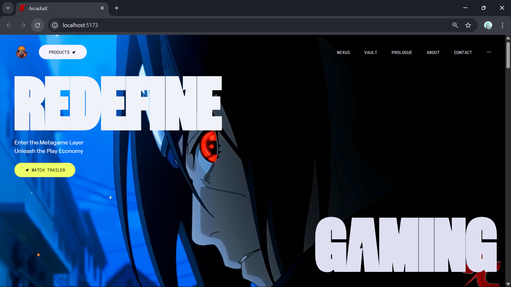
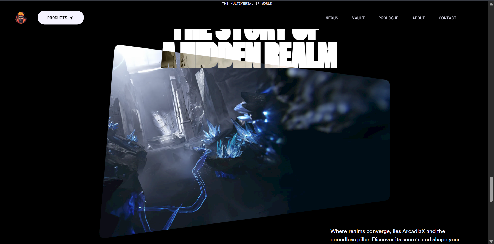
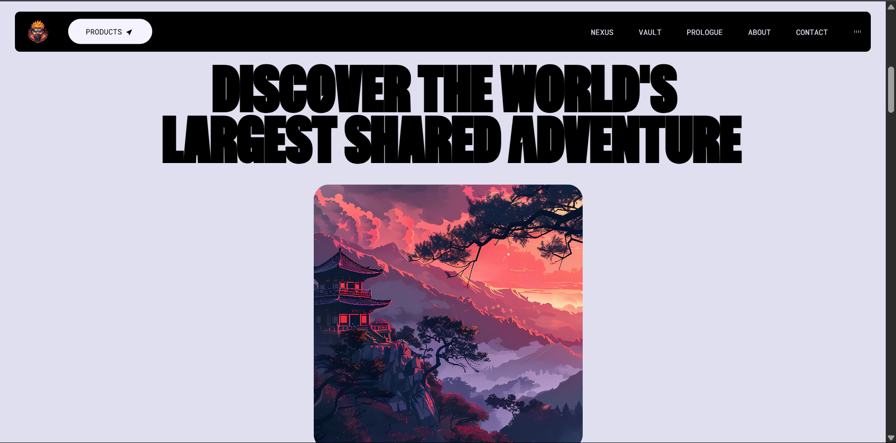
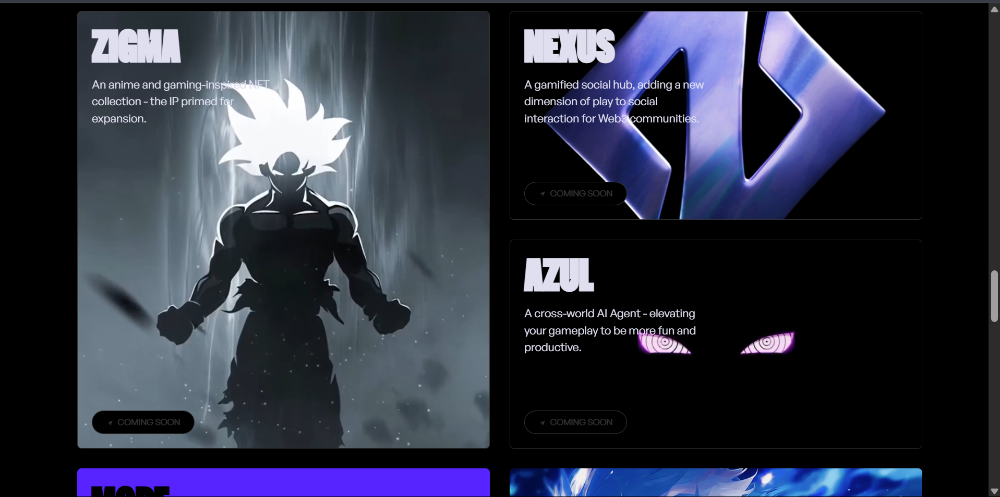
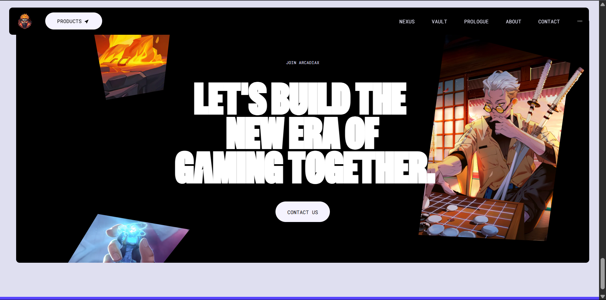

# 🎮 ArcadiaX – Futuristic Gaming Website

A visually immersive, frontend-focused gaming website that uses ReactJS and Tailwind CSS to deliver a smooth and engaging user experience enhanced by GSAP animations.

## 🚀 Key Features

- 🎨 **Immersive Visual Design**
  Built with ReactJS and Tailwind CSS for a modern and sleek interface.

- ✨ **GSAP Animations**
  Smooth scroll-based and entrance animations to enhance interactivity.

- 📱 **Responsive Layout**
  Custom video backgrounds and interactive UI elements that adapt seamlessly across devices.

- 🧹 **Clean Code Structure**
  Focused on maintainability, modern UI patterns, and consistent styling.

## 🛠️ Tech Stack

- **Frontend:** ReactJS, Tailwind CSS
- **Animations:** GSAP

## 🔗 Live Demo & Code

- **Video Demo:** [Demo](https://drive.google.com/file/d/120dhnQY3mPGTrQWG9o-3-tlpZ2PtXLqH/view)

## 📸 Preview

### Home Page

### Gameplay Preview

### About

### UI Elements

### Footer

## 📬 Contact

If you're interested in the implementation or want to discuss this project, feel free to reach out via [LinkedIn](https://www.linkedin.com/in/ashutosh-sahoo-32067b110/) or email at `ashutoshsahoo1985@gmail.com`.
